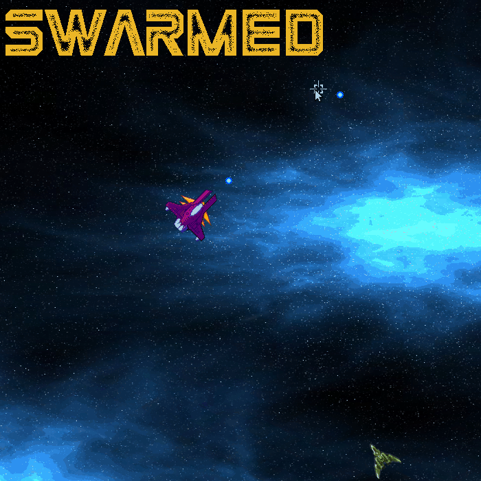

# CPPND: Capstone - Swarmed Game

You and your crew have become the target of an alien enemy suicide squad. Don't let them get you! Do whatever it takes to survive. How many of them can you take down with you before the end?

This repository is my version of the Capstone project in the [Udacity C++ Nanodegree Program](https://www.udacity.com/course/c-plus-plus-nanodegree--nd213). The code for this repo was originally inspired by [this](https://codereview.stackexchange.com/questions/212296/snake-game-in-c-with-sdl) excellent StackOverflow post and set of responses.

**Pro-Tip:** Looking to push the most of your skills? Modify the "parameters.h" file for a tougher challenge. Here you can change the default Enemy Spawning Time or the default HP of the characters. Go wild!

The Capstone Project represents a chance to integrate what we've learned throughout this program. Since several SDL2 elements need to be manually allocated and deallocated, this became a project focused mainly on Memory Management. Especially when dealing with SDL_Textures, we needed to be very careful when creating the wrappers, deciding which object will have property of the resource and which ones will borrow, and deallocating objects that were created on the heap. 

As a final thought, I just would like to add that I had a great time building this project. Even when it is still far away to be a complete game, I really hope you enjoy it. 

## How to Play
Control the position of your spaceship with the "W", "A", "S", "D" keys, and fire with the Mouse Left Click. You count with unlimited ammo, so shoot until your heart is content!

## Dependencies for Running Locally
* cmake >= 3.7
  * All OSes: [click here for installation instructions](https://cmake.org/install/)
* make >= 4.1 (Linux, Mac), 3.81 (Windows)
  * Linux: make is installed by default on most Linux distros
  * Mac: [install Xcode command line tools to get make](https://developer.apple.com/xcode/features/)
  * Windows: [Click here for installation instructions](http://gnuwin32.sourceforge.net/packages/make.htm)
* SDL2 >= 2.0
  * All installation instructions can be found [here](https://wiki.libsdl.org/Installation)
  >Note that for Linux, an `apt` or `apt-get` installation is preferred to building from source. 
* gcc/g++ >= 5.4
  * Linux: gcc / g++ is installed by default on most Linux distros
  * Mac: same deal as make - [install Xcode command line tools](https://developer.apple.com/xcode/features/)
  * Windows: recommend using [MinGW](http://www.mingw.org/)

## Basic Build Instructions

1. Clone this repo.
2. Make a build directory in the top level directory: `mkdir build && cd build`
3. Compile: `cmake .. && make`
4. Run it: `./Swarmed`.

## Special Thanks
* OpenGameArt.org: oglsdl - [Scope](https://opengameart.org/content/aim) texture.
* OpenGameArt.org: Gumichan01 - [Bullet](https://opengameart.org/content/tx-bullet-0) texture.
* OpenGameArt.org: Tummyache - [Spaceship](https://opengameart.org/content/purple-space-ship) texture.
* OpenGameArt.org: Redshrike - [Enemy](https://opengameart.org/content/space-ship-building-bits-volume-1) textures.
* OpenGameArt.org: Cuzco - [Space Background 1](https://opengameart.org/content/space-background) texture.
* OpenGameArt.org: leyren - [Space Background 2](https://opengameart.org/content/starsspace-background) texture.
* OpenGameArt.org: Scribe - [Space Background 3](https://opengameart.org/content/2d-space-background) texture.
* OpenGameArt.org: StumpyStrust - [Space Background 4](https://opengameart.org/content/space-background-2) texture.
* OpenGameArt.org: Westbeam - [Space Background 5](https://opengameart.org/content/space-background-1) texture.

* LazyFooProductions: [SDL Tutorials](https://lazyfoo.net/tutorials/SDL/index.php)
* ParallelRealities: [SDL2 Game Tutorials](https://www.parallelrealities.co.uk/tutorials/)

## CC Attribution-ShareAlike 4.0 International

Shield: [![CC BY-SA 4.0][cc-by-sa-shield]][cc-by-sa]

This work is licensed under a
[Creative Commons Attribution-ShareAlike 4.0 International License][cc-by-sa].

[![CC BY-SA 4.0][cc-by-sa-image]][cc-by-sa]

[cc-by-sa]: http://creativecommons.org/licenses/by-sa/4.0/
[cc-by-sa-image]: https://licensebuttons.net/l/by-sa/4.0/88x31.png
[cc-by-sa-shield]: https://img.shields.io/badge/License-CC%20BY--SA%204.0-lightgrey.svg
